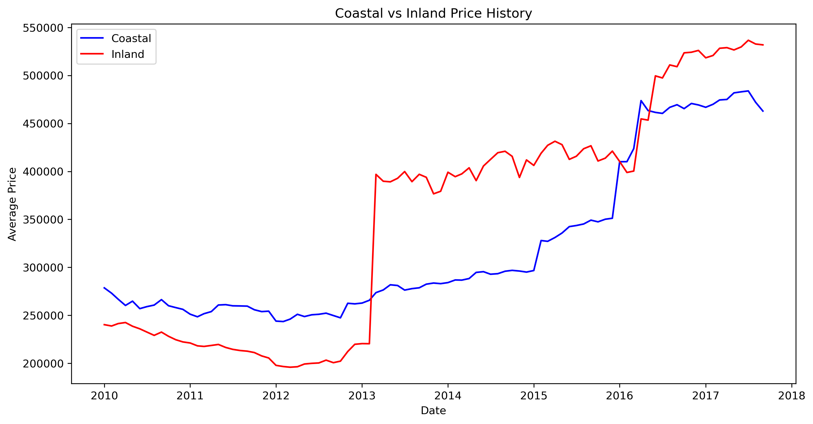
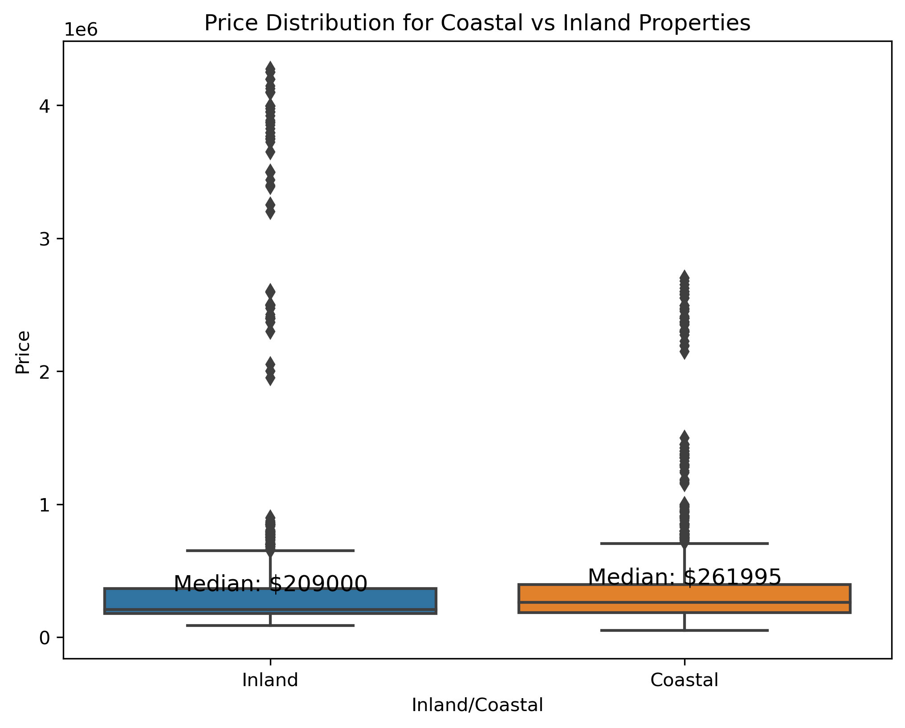
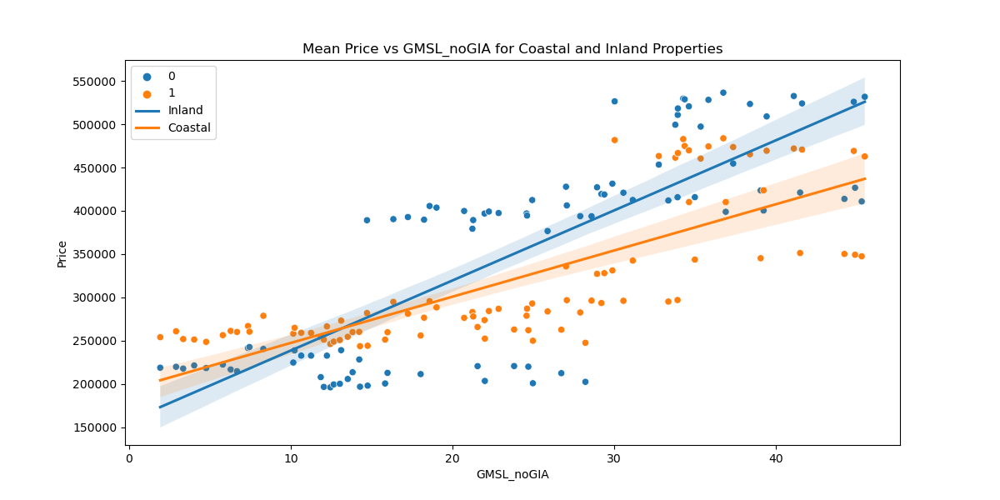
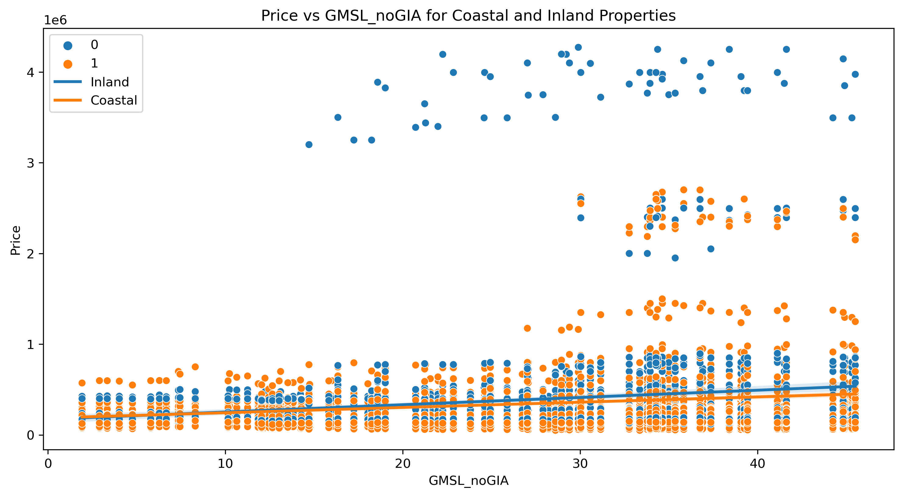
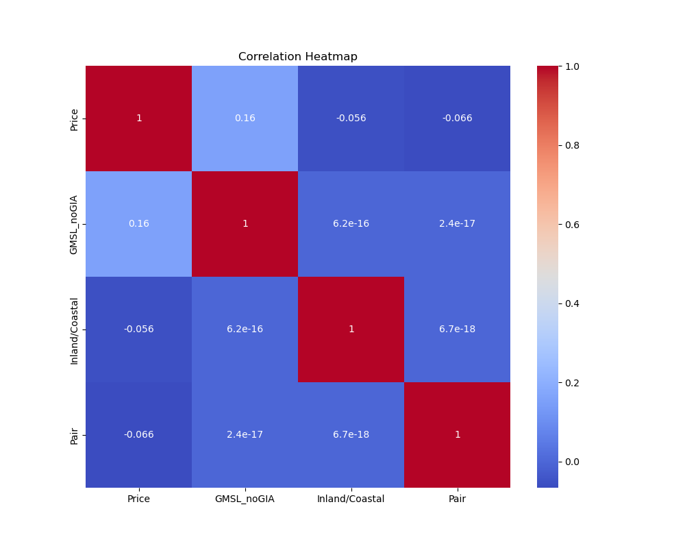
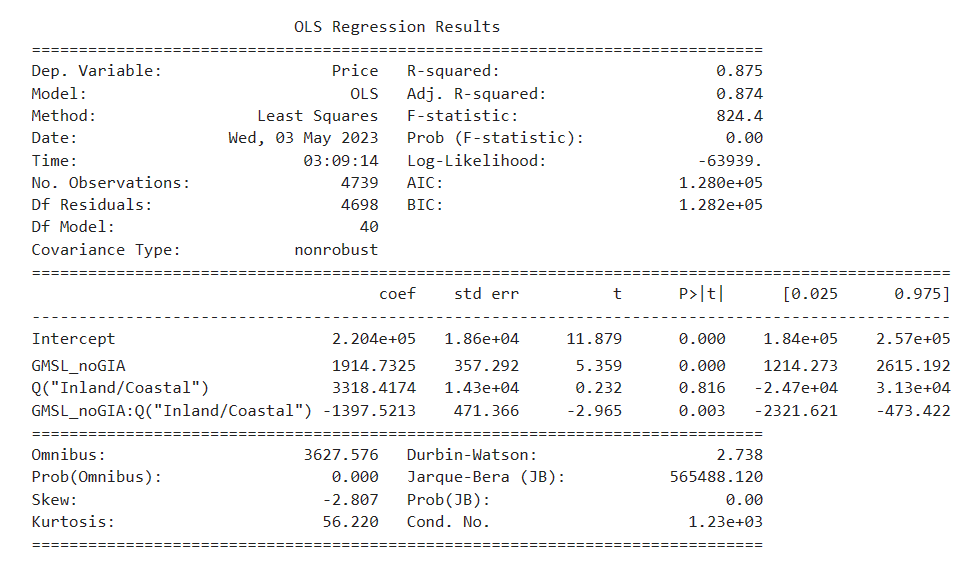
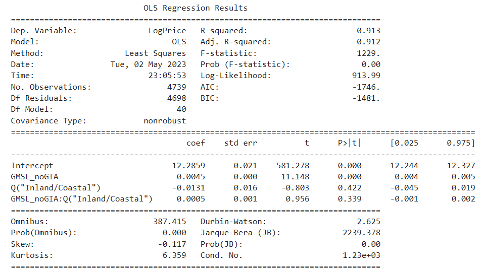
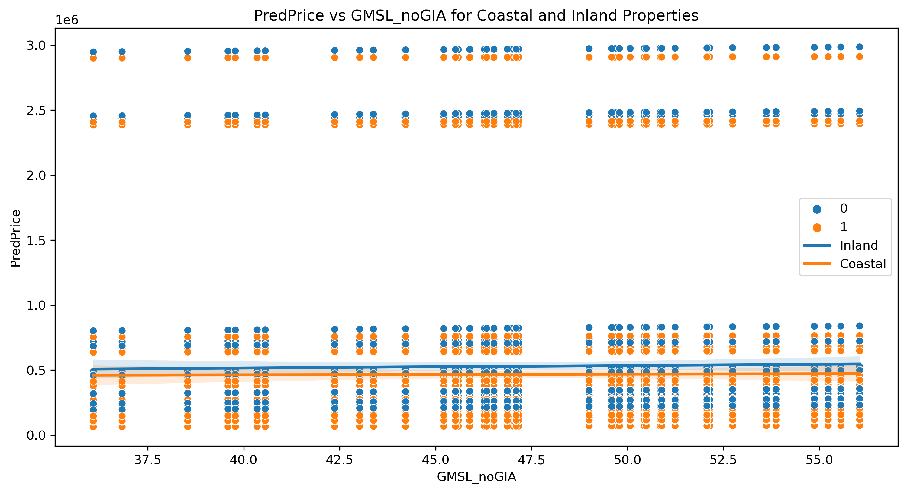
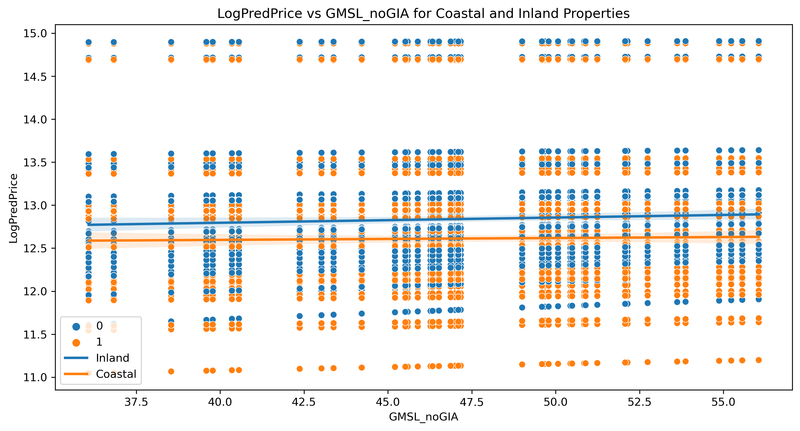

Welcome to Bozland! Home of the Bozzers  

## Table of contents
1. [Introduction](#introduction)
2. [Our Data](#dataclean)
3. [Methodology & Sample Code](#meth)
    1. [Cleaning](cleaning)
    2. [Visualizations](visualization)
    3. [Regression](Regression/regression.md)
5. [Analysis of Our Findings](#section2)
    1. [Price History](#subsec2-1)
    2. [Price Distribution](#subsec2-2)
    3. [Mean Price Coastal vs. Inland](#subsec2-3)
    4. [Price vs Sea Level](#subsec2-4)
    5. [Correlation](#subsec2-5)
6. [Linear Regression and Price Predictions](#regression)
7. [Future Discussion](#future)
8. [Summary](#summary)

## Introduction  

&nbsp;&nbsp;&nbsp;Over the past two decades, climate change has become a topical issue that many worry about due to its implications on our planet and quality of life. One effect of increasing temperatures from climate change is the melting of the polar ice caps which leads to high amounts of freshwater flooding our oceans and the sea level gradually rising. With this sea level rise comes numerous problems, one of which is its impact on coastal cities or homes. As sea levels rise, they erode beaches, reduce usable land, and jeopardize the integrity of structures that were not built in accordance with much higher sea levels. The rising sea level is a major concern for many coastal homeowners, and the main goal of this project is to analyze this problem further.

&nbsp;&nbsp;&nbsp;In our initial proposal, we wanted to analyze the correlation between the global sea level change and the listing prices for U.S. houses in coastal regions in an attempt to measure the relationship between rising sea levels and coastal housing prices. To answer this question we looked at the difference in median home listing prices for houses in different zip codes from the same coastal region. By comparing housing prices for zip codes that are directly on the coastline with those that are further inland, we can analyze if there is a correlation between housing price and sea level.

&nbsp;&nbsp;&nbsp;We also intended to examine the magnitude of impact on housing prices given how further inland a particular coastal zip code is, and to predict coastal property listing values given the estimated rise in U.S. coastal sea waters over the next ten years provided by the National Oceanic and Atmoshpheric Administration. 

&nbsp;&nbsp;&nbsp;Unfortunately, the ladder two questions we were unable to analyze given the constraints on our data. First, we could not locate enough accurate and consist median housing prices for inland zip codes at different distances from the coast. This is beacuse the the farther inland zipcodes were no longer comparable to our coastal zip codes as there were several variables, such as median housing price, size, altitude, and demographics, that are too different between the two regions. Therefore, we kept our analysis to looking at inland zip codes that are highly comparable to adjacent coastal zip codes to provide more accurate results. 

&nbsp;&nbsp;&nbsp;Moreover, we were unable to predict coastal property listing values over the next 10 years primarily due to our timing constraint and our overenthusiasm in trying to use our regression to make real world predictions. We ran into multiple problems trying to create our predictions as after we filtered the intial dataset we attempted to reinclude pricing information for later dates through 2021. However, this caused several issues including not predicting prices and having certain zipcodes come up as NaN. With more time we would investigate this problem further to create accurate predictions, but for today we decided to move forward and pivot our prediction to trying to predict prices for inland and coastal homes in our test dataset from 2017 - 2021 given a rise in sea level. While we recognize this prediction does not provide us with real world estimations for future prices, we wanted to test the accuracy of our predicition model to see if it could be used for future housing price predictions once we were able to fix our problem with loading in more current data. 

&nbsp;&nbsp;&nbsp;For our hypothesis, we predicted that a rise in sea level has a statistically significant impact on the listing prices of homes in U.S. coastal cities when compared to home prices in adjacent zip codes. To explore this hypothesis, our null hypothesis is that the median change in coastal city home listing prices associated with a 1 mm rise in global sea levels is equal to 0, or β1 = 0, with all other variables held constant. Our alternative hypothesis therefore tests if this association is not equal to one, or β1 ≠ 0, and if any correlation is present between these variables.

To answer these questions above, we worked as a team to analyze our filtered dataset and create visualizations that accurately display our findings. We are excited to present our analysis methods and findings below:

## Our Data 

&nbsp;&nbsp;&nbsp;To answer our hypothesis, we located a dataset from Data World that contains Zillow’s median home listing price for every zip code in the United States. The dataset contains median housing prices from January of 2010 to September of 2017. Each column presents the median housing price for the given month of a year, and for our analysis we plan to analyze the data from 2013 to 2017 as there is considerably more data recorded in the later years of this dataset.

&nbsp;&nbsp;&nbsp;Additionally, from Kaggle we were able to locate data on global sea level rises over the past three decades (1991-2021). In this dataset, the primary variable we will be using for analysis is GMSL (Global Isostatic Adjustment (GIA) not applied) variation (mm) with respect to 20-year TOPEX/Jason collinear mean reference. Not accounting for Global Isostatic Adjustment means that we will not be accounting for possible movements in the earth's crust under or around ice caps. Additionally, the 20-year TOPEX/Jason collinear mean reference is a prominently used study that examines historic sea levels rises and predicts a trend of a rise of 3.3 mm/year in sea level. Therefore, this variable is simply stating the variation in sea level height (mm) from the TPOPEX/Jason Collinear mean reference.

&nbsp;&nbsp;&nbsp;Finally, to obtain our comparable inland and coastal properties, we used the [United States Postal Service's](https://www.unitedstateszipcodes.org/) map of all U.S. zip codes. This website also provides region specific information such as the size, population, population density, median home value, and demographics for each zip code which we used as key variables when trying to identify comparable zip codes. Our selection process including identifying coastal cities that we wanted to analyze and then manually selecting and comparing key variables between adjacent inland and coastal zip codes with an emphasis on the size, population density, and median home value of each region. 

To prepare our data for subsequent visualiation, we had to:

1. Import necessary libraries:   
&nbsp;&nbsp;&nbsp;We imported pandas and DateOffset from pandas.tseries.offsets.

2. Load data:  
&nbsp;&nbsp;&nbsp;We loaded both datasets, 'sealevel.csv' and 'Zip_homes.csv', using read_csv.

3. Transpose and format housing price data:  
&nbsp;&nbsp;&nbsp;We transposed the 'Zip_homes.csv' data to have columns as years and rows as zip codes. We then reset the index, set the year as the index, and &nbsp;&nbsp;&nbsp;renamed the RegionName column to Year. Finally we formatted the data to have a datetime index.

4. Filter sea level data:  
&nbsp;&nbsp;&nbsp;We took one in every three recordings and dropped any subsequent recordings after the 12th. This was to make our sea level recordings monthly and to &nbsp;&nbsp;&nbsp;better match them to our yearly comparisons in median housing price. 

5. Merge datasets:  
&nbsp;&nbsp;&nbsp;We merged the two datasets using an outer join and set the Date column as the new index.

6. Filter merged dataset:  
&nbsp;&nbsp;&nbsp;We filtered the merged dataset to contain only data from January 2010 to September 2017.

7. Create new datasets:  
&nbsp;&nbsp;&nbsp;The code defines our selected zip codes, combines our coastal and inland data with our sea level data, transposes the data, resets the index, and &nbsp;&nbsp;&nbsp;sets our column  labels

8. Export data:  
&nbsp;&nbsp;&nbsp;The code exports the final cleaned and filtered merged dataset as 'filtered_merged_data.csv'

## Methodology 

This section includes code we felt was critical to highlight due to its importance in various steps of our analysis. We have divided the code into three subsections:
- [Cleaning](cleaning)
- [Visualizations](visualization)
- [Regression](Regression/regression.md)

[Information about our Zip Codes can be found here](page2).

## Analysis of Our Findings 

### Price History 

  
The above figure is a line plot created by taking the mean housing prices, grouped by Date and the categorical variable indicating whether the zip code is inland or coastal (Inland/Coastal). Overall, there is an upward trend for both coastal and inland housing prices over the period 2010-2017. Over time, inland zip codes and houses have risen to be higher than coastal ones, especially after 2013. In particular, the period 2010-2013 observes a distinct gap between coastal and inland housing prices, with coastal prices being higher than inland prices. After 2013, the trend reverses tremendously as inland housing prices rocketed to be above coastal prices, with likely twice as large the magnitude in the discrepancy between the mean housing prices. Possible explanations for this phenomenon are due to natural disasters (e.g. Hurricane Sandy) and the interaction of supply and demand. Post-event, people may find it dangerous to live in coastal areas and move inland instead. At the beginning of 2016, there was a short period when coastal prices were rising a bit above inland prices, but inland prices significantly increased after the second half of 2016 and surpassed coastal prices until after 2017. There might be a seasonality pattern emerging from observing the above figure, in which housing prices stayed at around the same level every 3 years (2010-2013 and 2013-2016). However, our data may not be comprehensive enough to reveal any true meaningful trend and pattern in housing prices over the period.

### **Price Distribution** 

Examining our data with regard to housing prices, it is clear that people pay a premium to live in areas with closer proximity to the ocean as the median house price of a coastal home is over $50,000 higher than that of the median for inland homes. This observation made sense to our team given that many people view living close to the ocean to be a luxury and explains why the median home prices currently trend higher for coastal homes than inland. However, coastal homes in our dataset also tend to have a much smaller range with regard to their median housing prices. While our intuition may lead us to believe that the range for coastal homes should be broader, given that some of the most expensive homes tend to be right on the water, we believe that this range will actually continue to consolidate even further in the future as sea level continues to rise.

  

A multitude of negative side effects can be attributed to increases in sea level, including factors like [the increased severity and frequency of hurricanes](https://www.c2es.org/content/hurricanes-and-climate-change/), which can result in a stark impact on the devaluation of coastal properties. As sea level rises, flooding and other natural weather phenomena will continue to wreak havoc on these coastal properties which can lead to [extensive damage and discourage people from purchasing or building on these properties in the future](https://anderson-review.ucla.edu/is-the-1-trillion-coastal-housing-market-a-future-financial-crisis/). Given that sea level rise has been on an upwards trend for decades, and experts expect this trend to continue into the future if action isn’t taken, we believe that the median price of coastal homes will continue to decrease while inland homes will become more sought after. As a result, the range and median prices of coastal homes will continue to shrink as many people will not be willing to take the risk to invest large sums of money in these areas. This belief is supported by our findings in our upcoming graphs, as it is clear that rise in sea level has a negative impact on median prices for coastal homes while increasing the value of properties in adjacent inland zip codes.

### Mean Price Coastal vs. Inland 

  
The linear regression plot figure was created from the mean housing prices, grouped by the sea level measurement GMSL_noGIA and the categorical variable Inland/Coastal. The scatter plot demonstrates the relationship between housing prices and GMSL_noGIA, with the colors indicating whether or not they were coastal or inland. We observe that inland prices are more scattered towards the two ends of the prices, with values concentrated more in the high price - high sea level area. In contrast, coastal prices mostly stay in the center, meaning these coastal housing values accumulate more in the low price – low sea level area. Overall, the slope of the fitted inland trend line is steeper than that of the coastal. This shows how the housing prices for inland zip codes are more sensitive to rising sea levels than coastal ones. With increased sea level risks, people would rather move inwards and demand more inland homes, thus raising the inland housing prices as opposed to coastal prices.

### Price vs Sea Level 

  

When examining how the rise of sea level affects median housing price, we thought it was also important to visualize how each individual zip code fares when sea level rises and to examine the grouping of these data points on the basis of location (either inland or coastal). Our hypothesis stated that as sea level increases, we would expect the median home prices of coastal zip codes to fall while median home prices of adjacent inland zip codes would increase. Our analysis of the resulting graph strongly supports this hypothesis, as it is clear that the median home prices in inland areas are far higher as sea level rises when compared to their coastal counterparts. The trendline for each grouping of zip codes further supports this claim, as although both coastal and inland zip codes are experiencing increases in median home prices, which can be attributed to the natural increase of home prices through inflation, the gap between these trend lines increases at a rate comparable to sea level rise. The upper level of our chart is also completely dominated by these inland zip codes, which gives further credence to our hypothesis that as sea level continues to rise these homes will continue to gain value. 

### Correlation Heatmap 

  
Lastly, we thought it was important to close our analysis by examining the observable correlations between a number of factors critical to our analysis. To accomplish this, we believed the inclusion of a heatmap would be most appropriate to communicate these correlations, which can be observed above. This heat map clearly outlines that the most significant relationship we have is between price and sea level, which has a positive correlation of 0.16 further verifying the importance and validity of this relationship. 

## Linear Regression and Price Predictions 

Our linear regression formulas and model results are below:
  

$$Price \sim GMSL_{noGIA} \times Q("Inland/Coastal") + C(Pair)$$

  

  
The simple linear regression coefficients indicate that 1 unit increase in GMSL_noGIA sea level measurement (mm) is associated with $1914.73 increase in housing price. Housing price is $3318.42 higher for cases when the house is coastal than when it is inland.
  

$$LogPrice \sim GMSL_{noGIA} * Q("Inland/Coastal") + C(Pair)$$

  

  
The linear regression coefficients with log(price) indicate that a 1 unit increase in GMSL_noGIA sea level measurement (mm) is associated with 0.45% higher in housing prices. Housing prices are about 1.31% lower for cases when houses are coastal than when they are inland. The log(price) seems to produce better results than the other model based on the smaller standard error and higher R-squared figures.
  
In both formulas, the interaction term between sea level measurement and the categorical variable Inland/Coastal is negative, which means that the effect of GMSL_noGIA on the outcome variable is greater for the "Inland" category compared to the "Coastal" category. Both models have negative skewness, which means the housing price data is skewed left. Both have a large kurtosis (>3), making the distribution of the data more resemble a thin “bell” with a high peak.

 
[Our house price predictions for the holdout period 2017 - 2021](outputs/combined_predict.csv)
 

Finally, given the prediction results, we created the two scatterplots of our predicted prices over the five years and plotted the trend lines of the results. The difference between the two graphs is that the first uses just our predicted prive for the period while the second takes the log of our predicted price. We chose to make this second graph because we though it may help to linearize the relationship between our two variables.

  
Our first graph is a scatter plot of our predicted inland and coastal median housing prices from 2017 - 2021 given the expected rise in sea level in 2017. We created this graph not to display the accuracy of our model, but rather to further display the relationship between rising sea levels and coastal housing prices. As seen above, the trendline for inland housing prices is growing at a greater rate than the trendline for coastal housing prices which we believe is due to the effect rising sea levels are having on the value of coastal properties.
  

  
To continue, our second graph displays the same scatter plot with the exception that we have taken the log of our predicted price in an attempt to help linearize the relationship, and we beleive this further demonstrates the widening gap between comparable coastal and inland properties as sea levels rise from 2017 - 2021.
  

## Further Discussion and Next Steps 
Regarding further discussion and continuation of our research and analysis, some possible considerations include improving our data collection method. We plan to collect more historical data for the housing prices and zip codes that span more US regions. Currently, we only have 2 zip codes for each selected city that indicates whether it is coastal or inland. We plan to incorporate more zip codes for each region and analyze the magnitude of impact on housing prices if a house was further inland or nearer the shore. It would also be interesting to see the price trend during the 2007-2008 housing mortgage crisis. As part of our explanatory research into the model correlations, we acknowledge other factors that could be influencing our housing prices - business presence, food and entertainment activities, as well as regional price differences in the zip codes. We may also experiment with other methods of regressing the price data and improving our model accuracy and prediction results. This could be building a pipeline for data preprocessing and normalization, feature selection and creation, and different regression models (e.g. Lasso, Ridge). We may utilize machine learning techniques and try models such as neural networks and random forest classification and regression. 

## Summary 

Ultimately, we set out to measure the possible correlation between the global sea level change and the listing prices for U.S. houses in coastal regions in an attempt to measure the relationship between rising sea levels and coastal housing prices. By using Zillow's median housing prices per zipcode from 2013 - 2017 and global sea level data over the same period we were able to conduct a regression analysis. After cleaning, filtering, and merging the data we coded a series of visualizations to explore the relationships between our variabels. These visualizations that we explored above uncovered interesting patterns about our data. This included large price jumps in coastal areas in 2013 that we believe likely to be due to reactions to Hurricane Sandy. We also notably created a linear regression between our coastal and inland housing prices and the change in sea level. This graph displayed that as the sea level rose inland housing prices grew at a greater rate than comparable coastal properties. This supported our initial hypothesis as it shows coastal properties being valued higher at lower sea levels, but lower than many comparable inland properties when sea levels signicantly rise. Additionally, because we were unable to answer all of the questions in the intial scope of our proposal, we attempted to use our regression model to predict housing prices for coastal and inland properties from 2017 - 2021 given the rise in sea level over the period and actually obtained fairly accurate results as well as additional data to support our hypothesis. Finally, for our actual regression, we used the equation   $$Price \sim GMSL_{noGIA} \times Q("Inland/Coastal") + C(Pair)$$   In this equation, we notably treated the Pair variable as a categorical variable to help improve our regressions accuracy by treating each comparable pair as its own category. From this regression, we obtained a β of -1397.5213 for the interaction variable of GMSL_noGIA:Q("Inland/Coastal"). This supports our alternate hypothesis that the β coefficient is not equal to 0. Additionally, the negative sign of the β further supports our idea that as sea levels rise inland housing prices are rising faster than comparable coastal housing prices.

In conclusion, we recognize that there are numerous other factors likely contributing to the difference in the rise in housing prices between comparable inland and coastal properties that we cannot account for in this analysis, but we are confident that our report shows there is a strong association between the rise in global sea level and median coastal housing prices in cities across the United States. 

## Meet the team

 
The Boz, aka Andrew, is a senior at Lehigh studying finance and business information systems. He can be contacted [here.](https://www.linkedin.com/in/andrew-bosland-1bb1a6174/)
   

 
Bozymandias, aka Will, is a senior at Lehigh studying finance, real estate, and business information systems. He can be contacted [here.](https://www.linkedin.com/in/william-rothpletz)  
   

 
Bozzinhton, aka Linh, is a senior at Lehigh studying finance, business analytics, business information systems, and Chinese. She can be contacted [here.](https://www.linkedin.com/in/mlinhtthai/)
   

 
Bozzler, aka Carter, is a senior at Lehigh studying finance. He can be contacted [here.](https://www.linkedin.com/in/carter-karinshak-782583220/)

## More 

To view the GitHub repo for this website, click [here](https://github.com/WilliamRoth82/BozandtheBozzers).
