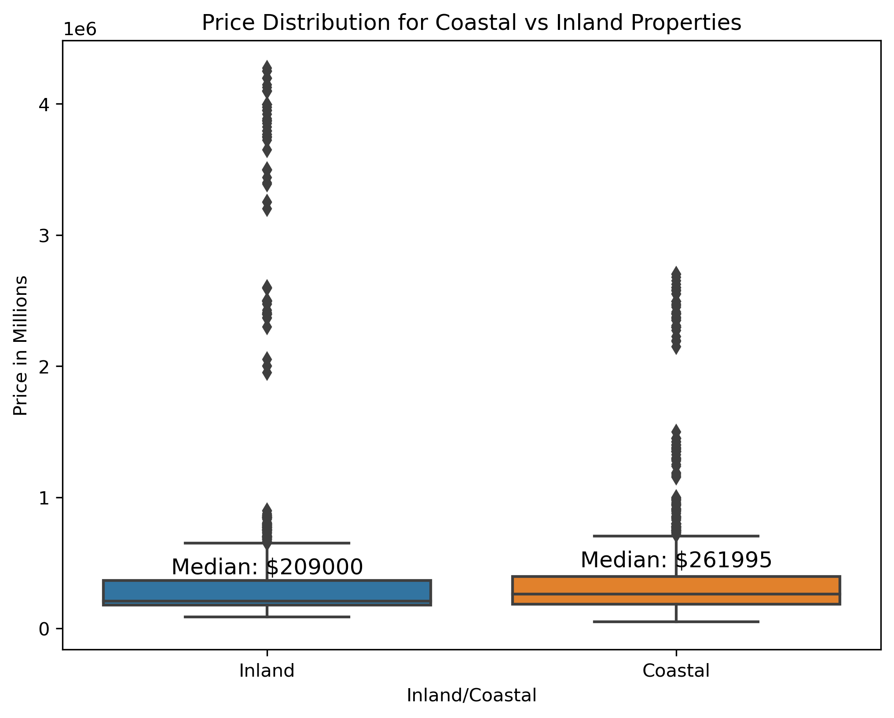
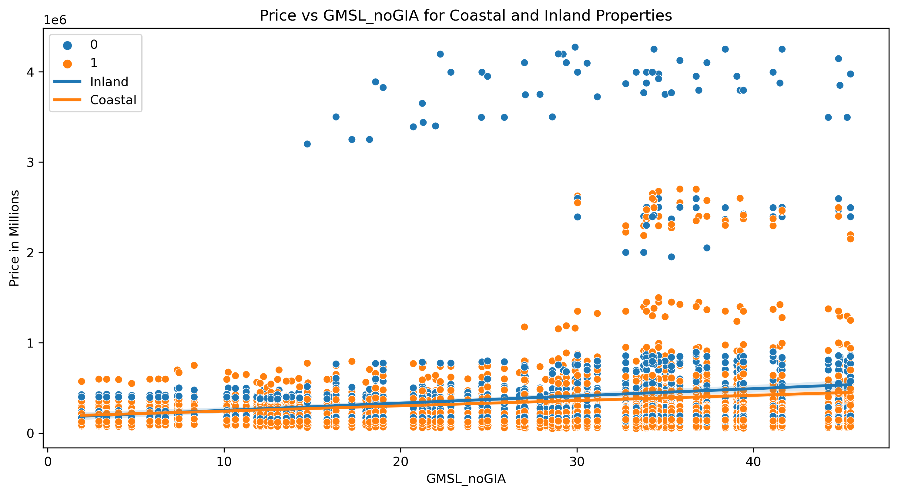
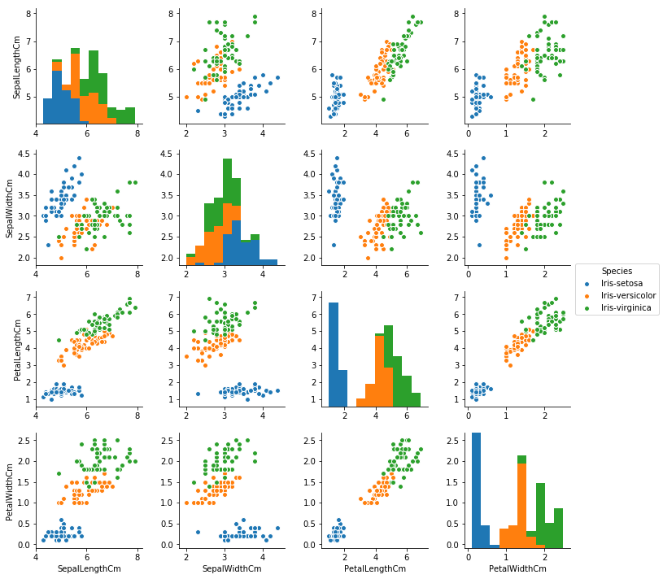

<span style="color:lightblue; font-size:36px; font-weight:bold;">Welcome to Bozland! Home of the Bozzers</span> <br>

## Table of contents
1. [Introduction](#introduction)
2. [Our Data](#dataclean)
3. [Methodology](#meth)
4. [Analysis of Our Findings](#section2)
    1. [Price History](#subsec2-1)
    2. [Price Distribution](#subsec2-2)
    3. [Mean Price Coastal vs. Inland](#subsec2-3)
    4. [Price vs Sea Level](#subsec2-4)
    5. [Correlation](#subsec2-5)
5. [Future Predictions](#section3)
6. [Summary](#summary)

## Introduction  <a name="introduction"></a>

(The "Introduction" text above is formatted in heading 2 style.) The main goal of this project is to explore *(insert project idea here)*.  


## Our Data <a name="dataclean"></a>
Info about our data and how we sourced/cleaned it here.

## Methodology <a name="meth"></a>

Here is some code that we used to develop our analysis. Blah Blah. [More details are provided in the Appendix](page2).
 
Note that for the purposes of the website, you have to copy this code into the markdown file and  
put the code inside trip backticks with the keyword `python`.

```python
import seaborn as sns 
iris = sns.load_dataset('iris') 

print(iris.head(),  '\n---')
print(iris.tail(),  '\n---')
print(iris.columns, '\n---')
print("The shape is: ",iris.shape, '\n---')
print("Info:",iris.info(), '\n---') # memory usage, name, dtype, and # of non-null obs (--> # of missing obs) per variable
print(iris.describe(), '\n---') # summary stats, and you can customize the list!
print(iris['species'].value_counts()[:10], '\n---')
print(iris['species'].nunique(), '\n---')
```

Notice that the output does NOT show! **You have to copy in figures and tables from the notebooks.**


## Analysis of Our Findings <a name="section2"></a>
Talk about our overall findings here and include information about our data.

### Price History <a name="subsec2-1"></a>
This is a subsection, formatted in heading 3 style


<br><br>
Some analysis here

### Price Distribution <a name="subsec2-2"></a>
This is a subsection, formatted in heading 3 style


<br><br>
Some analysis here

### Mean Price Coastal vs. Inland <a name="subsec2-3"></a>
This is a subsection, formatted in heading 3 style


<br><br>
Some analysis here

### Price vs Sea Level <a name="subsec2-4"></a>
This is a subsection, formatted in heading 3 style


<br><br>
Some analysis here

### Correlation Heatmap <a name="subsec2-5"></a>
This is a subsection, formatted in heading 3 style


<br><br>
Some analysis here

## Future Predictions <a name="section3"></a>

Here are some graphs that we created in our analysis. We saved them to the `pics/` subfolder and include them via the usual markdown syntax for pictures.


<br><br>
Some analysis here
<br><br>

<br><br>
More analysis here.
<br><br>

<br><br>
More analysis.

## Summary <a name="summary"></a>

Blah blah


## About the team


<br>
The Boz, aka Bos, is a senior at Lehigh studying finance. 
<br><br><br>

<br>
Bozymandias, aka Will, is a senior at Lehigh studying finance, real estate, and business information systems <br>
<br><br><br>

<br>
Bozington, aka Linh, is a senior at Lehigh studying finance.
<br><br><br>

<br>
Bozzler, aka Carter, is a senior at Lehigh studying finance. 


## More 

To view the GitHub repo for this website, click [here](https://github.com/WilliamRoth82/BozandtheBozzers).
