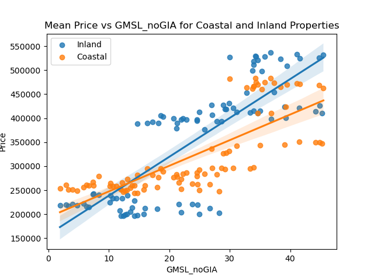
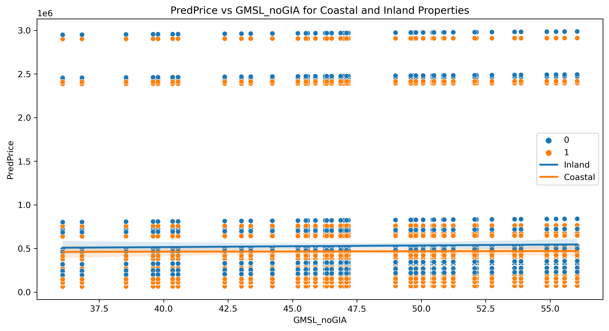

<span style="color:lightblue; font-size:36px; font-weight:bold;">Welcome to Bozland! Home of the Bozzers</span> <br>

## Table of contents
1. [Introduction](#introduction)
2. [Our Data](#dataclean)
3. [Methodology](#meth)
    1. [Cleaning](#methclean)
    2. [Visualizations](#methviz)
    3. [Regression](#methreg)
5. [Analysis of Our Findings](#section2)
    1. [Price History](#subsec2-1)
    2. [Price Distribution](#subsec2-2)
    3. [Mean Price Coastal vs. Inland](#subsec2-3)
    4. [Price vs Sea Level](#subsec2-4)
    5. [Correlation](#subsec2-5)
6. [Future Predictions](#section3)
7. [Summary](#summary)

## Introduction  <a name="introduction"></a>

&nbsp;&nbsp;&nbsp;Over the past two decades, climate change has become a topical issue that many worry about due to its implications on our planet and quality of life. One effect of increasing temperatures from climate change is the melting of the polar ice caps which leads to high amounts of freshwater flooding our oceans and the sea level gradually rising. With this sea level rise comes numerous problems, one of which is its impact on coastal cities or homes. As sea levels rise, they erode beaches, reduce usable land, and jeopardize the integrity of structures that were not built in accordance with much higher sea levels. The rising sea level is a major concern for many coastal homeowners, and the main goal of this project is to analyze this problem further.

&nbsp;&nbsp;&nbsp;In our initial proposal, we wanted to analyze the correlation between the global sea level change and the listing prices for U.S. houses in coastal regions in an attempt to measure the relationship between rising sea levels and coastal housing prices. To answer this question we looked at the difference in median home listing prices for houses in different zip codes from the same coastal region. By comparing housing prices for zip codes that are directly on the coastline with those that are further inland, we can analyze if there is a correlation between housing price and sea level.

&nbsp;&nbsp;&nbsp;We also intended to examine the magnitude of impact on housing prices given how further inland a particular coastal zip code is, and to predict coastal property listing values given the estimated rise in U.S. coastal sea waters over the next ten years provided by the National Oceanic and Atmoshpheric Administration. 

&nbsp;&nbsp;&nbsp;Unfortunately, the ladder two questions we were unable to analyze given the constraints on our data. First, we could not locate enough accurate and consist median housing prices for inland zip codes at different distances from the coast. This is beacuse the the farther inland zipcodes were no longer comparable to our coastal zip codes as there were several variables, such as median housing price, size, altitude, and demographics, that are too different between the two regions. Therefore, we kept our analysis to looking at inland zip codes that are highly comparable to adjacent coastal zip codes to provide more accurate results. 

&nbsp;&nbsp;&nbsp;Moreover, we were unable to predict coastal property listing values over the next 10 years primarily due to our timing constraint and our overenthusiasm in trying to use our regression to make real world predictions. We ran into multiple problems trying to create our predictions as after we filtered the intial dataset we attempted to reinclude pricing information for later dates through 2021. However, this caused several issues including not predicting prices and having certain zipcodes come up as NaN. With more time we would investigate this problem further to create accurate predictions, but for today we decided to move forward and pivot our prediction to trying to predict prices for inland and coastal homes in our test dataset from 2017 - 2021 given a rise in sea level. While we recognize this prediction does not provide us with real world estimations for future prices, we wanted to test the accuracy of our predicition model to see if it could be used for future housing price predictions once we were able to fix our problem with loading in more current data. 

&nbsp;&nbsp;&nbsp;For our hypothesis, we predicted that a rise in sea level has a statistically significant impact on the listing prices of homes in U.S. coastal cities when compared to home prices in adjacent zip codes. To explore this hypothesis, our null hypothesis is that the median change in coastal city home listing prices associated with a 1 mm rise in global sea levels is equal to 0, or β1 = 0, with all other variables held constant. Our alternative hypothesis therefore tests if this association is not equal to one, or β1 ≠ 0, and if any correlation is present between these variables.

To answer these questions above, we worked as a team to analyze our filtered dataset and create visualizations that accurately display our findings. We are excited to present our analysis methods and findings below:

## Our Data <a name="dataclean"></a>

&nbsp;&nbsp;&nbsp;To answer our hypothesis, we located a dataset from Data World that contains Zillow’s median home listing price for every zip code in the United States. The dataset contains median housing prices from January of 2010 to September of 2017. Each column presents the median housing price for the given month of a year, and for our analysis we plan to analyze the data from 2013 to 2017 as there is considerably more data recorded in the later years of this dataset.

&nbsp;&nbsp;&nbsp;Additionally, from Kaggle we were able to locate data on global sea level rises over the past three decades (1991-2021). In this dataset, the primary variable we will be using for analysis is GMSL (Global Isostatic Adjustment (GIA) not applied) variation (mm) with respect to 20-year TOPEX/Jason collinear mean reference. Not accounting for Global Isostatic Adjustment means that we will not be accounting for possible movements in the earth's crust under or around ice caps. Additionally, the 20-year TOPEX/Jason collinear mean reference is a prominently used study that examines historic sea levels rises and predicts a trend of a rise of 3.3 mm/year in sea level. Therefore, this variable is simply stating the variation in sea level hieght (mm) from the TPOPEX/Jason Collinear mean reference.

&nbsp;&nbsp;&nbsp;Finally, to obtain our comparable inland and coastal properties, we used https://www.unitedstateszipcodes.org/ which is the United States Postal Service's map of all U.S. zip codes. This website also provides region specific information such as the size, population, population density, median home value, and demographics for each zip code which we used as key varaibles when trying to identify comparable zip codes. Our selection process including identifying coastal cities that we wanted to analyze and then manually selecting and comparing key variables between adjacent inland and coastal zip codes with an emphasis on the size, population density, and median home value of each region. 

To prepare our data for subsequent visualiation, we had to:

1. Import necessary libraries: <br> 
&nbsp;&nbsp;&nbsp;We imported pandas and DateOffset from pandas.tseries.offsets.

2. Load data: <br>
&nbsp;&nbsp;&nbsp;We loaded both datasets, 'sealevel.csv' and 'Zip_homes.csv', using read_csv.

3. Transpose and format housing price data: <br>
&nbsp;&nbsp;&nbsp;We transposed the 'Zip_homes.csv' data to have columns as years and rows as zip codes. We then reset the index, set the year as the index, and &nbsp;&nbsp;&nbsp;renamed the RegionName column to Year. Finally we formatted the data to have a datetime index.

4. Filter sea level data: <br>
&nbsp;&nbsp;&nbsp;We took one in every three recordings and dropped any subsequent recordings after the 12th. This was to make our sea level recordings monthly and to &nbsp;&nbsp;&nbsp;better match them to our yearly comparisons in median housing price. 

5. Merge datasets: <br>
&nbsp;&nbsp;&nbsp;We merged the two datasets using an outer join and set the Date column as the new index.

6. Filter merged dataset: <br>
&nbsp;&nbsp;&nbsp;We filtered the merged dataset to contain only data from January 2010 to September 2017.

7. Create new datasets: <br>
&nbsp;&nbsp;&nbsp;The code defines our selected zip codes, combines our coastal and inland data with our sea level data, transposes the data, resets the index, and &nbsp;&nbsp;&nbsp;sets our column  labels

8. Export data: <br>
&nbsp;&nbsp;&nbsp;The code exports the final cleaned and filtered merged dataset as 'filtered_merged_data.csv'

## Methodology <a name="meth"></a>

This section includes code we felt was critical to highlight due to its importance in various steps of our analysis. We have divided the code into three subsections:
- [Cleaning](https://github.com/WilliamRoth82/BozandtheBozzers/blob/main/Cleaning.md)
- Visualizations
- Regression

### Cleaning <a name="methclean"></a>

```python
# Merge two data sets
merged_data = pd.merge(transposed_data, filtered_data, how='outer', left_index=True, right_index=True)
merged_data.rename(columns={'Year': 'Date'}, inplace=True)
merged_data.index = merged_data.index.rename('Date')

merged_data.to_csv('inputs/merged_data.csv')

print(merged_data.head())
filtered_merged_data = merged_data.loc['2010-01':'2021-06']

print(filtered_merged_data.head())

filtered_merged_data.to_csv('inputs/filtered_merged_data.csv')
```

```python
Coastal = [36532.0, 36605.0, 99501.0, 94015.0, 93950.0, 93109.0, 77505.0, 19968.0, 19963.0, 19901.0, 19720.0, 33137.0, 33129.0, 33131.0, 33308.0, 33062.0, 32226.0, 96778.0, 70124.0, 70122.0, 70126.0, 39501.0, 29412.0, 29577.0, 29582.0, 77058.0, 77015.0, 21403.0, 21122.0, 21220.0, 10305.0, 10314.0, 11214.0, 10069.0, 10010.0, 28468.0, 23518.0, 23661.0]
Inland = [36576.0, 36606.0, 99508.0, 94014.0, 93940.0, 93108.0, 77504.0, 19947.0, 19960.0, 19904.0, 19702.0, 33127.0, 33145.0, 33130.0, 33309.0, 33060.0, 32218.0, 96771.0, 70118.0, 70119.0, 70116.0, 39503.0, 29407.0, 29579.0, 29566.0, 77062.0, 77020.0, 21401.0, 21060.0, 21237.0, 10304.0, 10306.0, 11204.0, 10023.0, 10003.0, 28467.0, 23502.0, 23666.0]
Combined = [36532.0, 36576.0, 36605.0, 36606.0, 99501.0, 99508.0, 94015.0, 94014.0, 93950.0, 93940.0, 93109.0, 93108.0, 77505.0, 77504.0, 19968.0, 19947.0, 19963.0, 19960.0, 19901.0, 19904.0, 19720.0, 19702.0, 33137.0, 33127.0, 33129.0, 33145.0, 33131.0, 33130.0, 33308.0, 33309.0, 33062.0, 33060.0, 32226.0, 32218.0, 96778.0, 96771.0, 70124.0, 70118.0, 70122.0, 70119.0, 70126.0, 70116.0, 39501.0, 39503.0, 29412.0, 29407.0, 29577.0, 29579.0, 29582.0, 29566.0, 77058.0, 77062.0, 77015.0, 77020.0, 21403.0, 21401.0, 21122.0, 21060.0, 21220.0, 21237.0, 10305.0, 10304.0, 10314.0, 10306.0, 11214.0, 11204.0, 10069.0, 10023.0, 10010.0, 10003.0, 28468.0, 28467.0, 23518.0, 23502.0, 23661.0, 23666.0]

additional_columns = [
    "TotalWeightedObservations",
    "GMSL_noGIA",
    "StdDevGMSL_noGIA",
    "SmoothedGSML_noGIA",
    "GMSL_GIA",
    "StdDevGMSL_GIA",
    "SmoothedGSML_GIA",
    "SmoothedGSML_GIA_sigremoved",
]

selected_columns = Coastal + Inland + additional_columns

filtered_zip = filtered_merged_data.loc[:, selected_columns]
filtered_zip = filtered_zip.reset_index()
```

```python
# Add the "Coastal/Inland" and "Pair" columns
transposed_filtered_zip['Inland/Coastal'] = transposed_filtered_zip['Zip'].apply(lambda x: 1 if x in Coastal else 0)
transposed_filtered_zip['Pair'] = 0
pair_index = 1

for i in range(0, len(Combined), 2):
    inland_zip = Combined[i]
    coastal_zip = Combined[i+1]
    transposed_filtered_zip.loc[transposed_filtered_zip['Zip'] == inland_zip, 'Pair'] = pair_index
    transposed_filtered_zip.loc[transposed_filtered_zip['Zip'] == coastal_zip, 'Pair'] = pair_index
    pair_index += 1

# Sort the DataFrame by the "Pair" column
transposed_filtered_zip = transposed_filtered_zip.sort_values(by='Pair')
```

```python
# Melt dataset - Rearrange data
transposed_filtered_zip = transposed_filtered_zip.iloc[8:]
melted_df = transposed_filtered_zip.melt(id_vars=['Zip', 'Inland/Coastal', 'Pair'],
                    var_name='Date',
                    value_name='Price')
                    
# Prep sea level data for merge and filter for the second date range (2017-10 to 2021-06)
filtered_data_2 = filtered_data.loc['2017-10':'2021-06'].reset_index()
# Merge:
zip_sea_new = pd.merge(melted_df_2, filtered_data_2.rename(columns={'Year': 'Date'}),
         on='Date', how='outer', validate='many_to_one')

zip_sea_new.to_csv('inputs/zip_sea_new.csv', index=False)
(zip_sea, zip_sea_new)
```

### Visualizations <a name="methviz"></a>

```python
#4
# Calculate mean price for each GMSL_noGIA value and group
mean_prices = zip_sea.groupby(['GMSL_noGIA', 'Inland/Coastal'])['Price'].mean().reset_index()

# Plot the scatterplot
plt.figure(figsize=(12, 6))
sns.scatterplot(x="GMSL_noGIA", y="Price", hue="Inland/Coastal", data=mean_prices)
plt.title("Mean Price vs GMSL_noGIA for Coastal and Inland Properties")

# Add linear regression lines for each group
coastal_data = mean_prices[mean_prices["Inland/Coastal"] == 1]
inland_data = mean_prices[mean_prices["Inland/Coastal"] == 0]

sns.regplot(x="GMSL_noGIA", y="Price", data=inland_data, scatter=False, label="Inland")
sns.regplot(x="GMSL_noGIA", y="Price", data=coastal_data, scatter=False, label="Coastal")

plt.legend()
plt.savefig("graphs/mean_price_vs_GMSL_noGIA.png")
plt.show()
```

### Regression <a name="methreg"></a>

```python
# Load the datasets using the given file paths
zip_sea = pd.read_csv('inputs/zip_sea.csv')
zip_sea_new = pd.read_csv('inputs/zip_sea_new.csv')

# Replace missing values with NaN
zip_sea['Price'] = pd.to_numeric(zip_sea['Price'], errors='coerce')
zip_sea_new['Price'] = pd.to_numeric(zip_sea_new['Price'], errors='coerce')

# Create the model formula
formula = 'Price ~ GMSL_noGIA * Q("Inland/Coastal") + C(Pair)'

# Create and fit the model using the training set (zip_sea.csv)
model = smf.ols(formula, data=zip_sea).fit()

# Evaluate the model using the testing set (zip_sea_new.csv) and calculate the R-squared score
zip_sea_new['PredPrice'] = model.predict(zip_sea_new)

# Save the predictions to a file called predict.csv in the outputs folder
zip_sea_new.to_csv('outputs/predict.csv', index=False)

# Output the model summary
print(model.summary())
```

```python
# Load the datasets using the given file paths
zip_sea = pd.read_csv('inputs/zip_sea.csv')
zip_sea_new = pd.read_csv('inputs/zip_sea_new.csv')

# Replace missing values with NaN
zip_sea['LogPrice'] = np.log(zip_sea['Price'])
zip_sea['LogPrice'] = zip_sea['LogPrice'].replace([np.inf, -np.inf], np.nan)
zip_sea_new['LogPrice'] = np.log(zip_sea_new['Price'])
zip_sea_new['LogPrice'] = zip_sea_new['LogPrice'].replace([np.inf, -np.inf], np.nan)

# Create the model formula
formula = 'LogPrice ~ GMSL_noGIA * Q("Inland/Coastal") + C(Pair)'

# Create and fit the model using the training set (zip_sea.csv)
model = smf.ols(formula, data=zip_sea).fit()

# Evaluate the model using the testing set (zip_sea_new.csv) and calculate the R-squared score
zip_sea_new['PredLogPrice'] = model.predict(zip_sea_new)

# Save the predictions to a file called predict.csv in the outputs folder
zip_sea_new.to_csv('outputs/predict2.csv', index=False)

# Output the model summary
print(model.summary())
```

[More details are provided in the Appendix](page2).

## Analysis of Our Findings <a name="section2"></a>

### Price History <a name="subsec2-1"></a>
This is a subsection, formatted in heading 3 style


<br><br>
Some analysis here

### **Price Distribution** <a name="subsec2-2"></a>

Examining our data with regard to housing prices, it is clear that people pay a premium to live in areas with closer proximity to the ocean as the median house price of a coastal home is over $50,000 higher than that of the median for inland homes. This observation made sense to our team given that many people view living close to the ocean to be a luxury and explains why the median home prices currently trend higher for coastal homes than inland. However, coastal homes in our dataset also tend to have a much smaller range with regard to their median housing prices. While our intuition may lead us to believe that the range for coastal homes should be broader, given that some of the most expensive homes tend to be right on the water, we believe that this range will actually continue to consolidate even further in the future as sea level continues to rise.


<br><br>

A multitude of negative side effects can be attributed to increases in sea level, including factors like the increased severity and frequency of hurricanes, which can result in a stark impact on the devaluation of coastal properties. As sea level rises, flooding and other natural weather phenomena will continue to wreak havoc on these coastal properties which can lead to extensive damage and disincentivize people to purchase or build on these properties in the future. Given that sea level rise has been on an upwards trend for decades, and experts expect this trend to continue into the future if action isn’t taken, we believe that the median price of coastal homes will continue to decrease while inland homes will become more sought after. As a result, the range and median prices of coastal homes will continue to shrink as many people will not be willing to take the risk to invest large sums of money in these areas. This belief is supported by our findings in our upcoming graphs, as it is clear that rise in sea level has a negative impact on median prices for coastal homes while increasing the value of properties in adjacent inland zip codes.

### Mean Price Coastal vs. Inland <a name="subsec2-3"></a>
This is a subsection, formatted in heading 3 style


<br><br>
Some analysis here

### Price vs Sea Level <a name="subsec2-4"></a>


<br><br>

When examining how the rise of sea level affects median housing price, we thought it was also important to visualize how each individual zip code fares when sea level rises and to examine the grouping of these data points on the basis of location (either inland or coastal). Our hypothesis stated that as sea level increases, we would expect the median home prices of coastal zip codes to fall while median home prices of adjacent inland zip codes would increase. Our analysis of the resulting graph strongly supports this hypothesis, as it is clear that the median home prices in inland areas are far higher as sea level rises when compared to their coastal counterparts. The trendline for each grouping of zip codes further supports this claim, as although both coastal and inland zip codes are experiencing increases in median home prices, which can be attributed to the natural increase of home prices through inflation, the gap between these trend lines increases at a rate comparable to sea level rise. The upper level of our chart is also completely dominated by these inland zip codes, which gives further credence to our hypothesis that as sea level continues to rise these homes will continue to gain value. 

### Correlation Heatmap <a name="subsec2-5"></a>


<br><br>
Lastly, we thought it was important to close our analysis by examining the observable correlations between a number of factors critical to our analysis. To accomplish this, we believed the inclusion of a heatmap would be most appropriate to communicate these correlations, which can be observed above. This heat map clearly outlines that the most significant relationship we have is between price and sea level, which has a positive correlation of 0.16 further verifying the importance and validity of this relationship. 

## Future Predictions <a name="section3"></a>

Here are some graphs that we created in our analysis. We saved them to the `pics/` subfolder and include them via the usual markdown syntax for pictures.


<br><br>
Some analysis here
<br><br>

<br><br>
More analysis here.
<br><br>

<br><br>
More analysis.

## Summary <a name="summary"></a>

Blah blah


## Meet the team


<br>
The Boz, aka Bos, is a senior at Lehigh studying finance. 
<br><br><br>

<br>
Bozymandias, aka Will, is a senior at Lehigh studying finance, real estate, and business information systems <br>
<br><br><br>

<br>
Bozington, aka Linh, is a senior at Lehigh studying finance.
<br><br><br>

<br>
Bozzler, aka Carter, is a senior at Lehigh studying finance. 


## More 

To view the GitHub repo for this website, click [here](https://github.com/WilliamRoth82/BozandtheBozzers).
