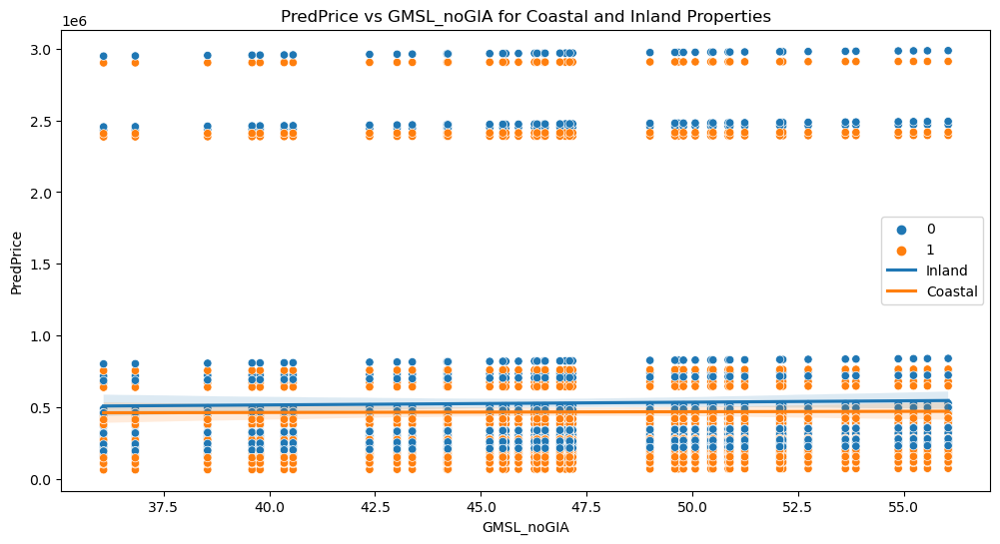
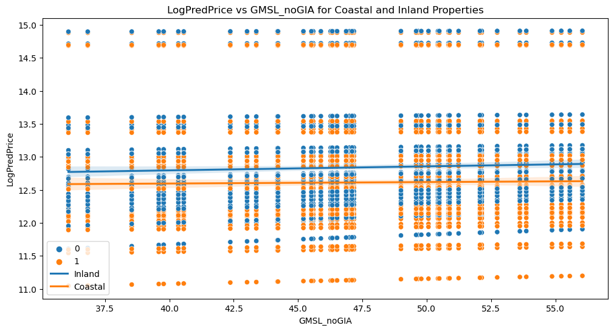

**Regression Code Snippets**


```python
import pandas as pd
import numpy as np
import statsmodels.api as sm
import statsmodels.formula.api as smf
from sklearn.metrics import r2_score

# Load the datasets using the given file paths
zip_sea = pd.read_csv('inputs/zip_sea.csv')
zip_sea_new = pd.read_csv('inputs/zip_sea_new.csv')

# Replace missing values with NaN
zip_sea['Price'] = pd.to_numeric(zip_sea['Price'], errors='coerce')
zip_sea_new['Price'] = pd.to_numeric(zip_sea_new['Price'], errors='coerce')

# Create the model formula
formula = 'Price ~ GMSL_noGIA * Q("Inland/Coastal") + C(Pair)'

# Create and fit the model using the training set (zip_sea.csv)
model = smf.ols(formula, data=zip_sea).fit()

# Evaluate the model using the testing set (zip_sea_new.csv) and calculate the R-squared score
zip_sea_new['PredPrice'] = model.predict(zip_sea_new)

# Save the predictions to a file called predict.csv in the outputs folder
zip_sea_new.to_csv('outputs/predict.csv', index=False)

# Output the model summary
print(model.summary())
```

                                OLS Regression Results                            
    ==============================================================================
    Dep. Variable:                  Price   R-squared:                       0.875
    Model:                            OLS   Adj. R-squared:                  0.874
    Method:                 Least Squares   F-statistic:                     824.4
    Date:                Wed, 03 May 2023   Prob (F-statistic):               0.00
    Time:                        03:09:14   Log-Likelihood:                -63939.
    No. Observations:                4739   AIC:                         1.280e+05
    Df Residuals:                    4698   BIC:                         1.282e+05
    Df Model:                          40                                         
    Covariance Type:            nonrobust                                         
    ==================================================================================================
                                         coef    std err          t      P>|t|      [0.025      0.975]
    --------------------------------------------------------------------------------------------------
    Intercept                       2.204e+05   1.86e+04     11.879      0.000    1.84e+05    2.57e+05
    C(Pair)[T.2]                   -1.797e+05   2.31e+04     -7.791      0.000   -2.25e+05   -1.34e+05
    C(Pair)[T.3]                    7809.4521   2.17e+04      0.359      0.719   -3.48e+04    5.04e+04
    C(Pair)[T.4]                     4.27e+05   2.34e+04     18.227      0.000    3.81e+05    4.73e+05
    C(Pair)[T.5]                    5.118e+05   2.09e+04     24.476      0.000    4.71e+05    5.53e+05
    C(Pair)[T.6]                    2.658e+06    2.4e+04    110.636      0.000    2.61e+06    2.71e+06
    C(Pair)[T.7]                   -5.444e+04   2.22e+04     -2.451      0.014    -9.8e+04   -1.09e+04
    C(Pair)[T.8]                    -672.3418   1.96e+04     -0.034      0.973   -3.91e+04    3.78e+04
    C(Pair)[T.9]                   -3.692e+04   1.99e+04     -1.852      0.064    -7.6e+04    2152.773
    C(Pair)[T.10]                  -6.049e+04   1.96e+04     -3.082      0.002    -9.9e+04    -2.2e+04
    C(Pair)[T.11]                  -6.696e+04   2.07e+04     -3.235      0.001   -1.08e+05   -2.64e+04
    C(Pair)[T.12]                   1.469e+05   3.25e+04      4.513      0.000    8.31e+04    2.11e+05
    C(Pair)[T.13]                   1.723e+05   2.29e+04      7.521      0.000    1.27e+05    2.17e+05
    C(Pair)[T.14]                    1.68e+05   2.07e+04      8.132      0.000    1.27e+05    2.08e+05
    C(Pair)[T.15]                   3.706e+04   2.09e+04      1.772      0.076   -3939.019    7.81e+04
    C(Pair)[T.16]                   7.841e+04    2.2e+04      3.557      0.000    3.52e+04    1.22e+05
    C(Pair)[T.17]                   -5.26e+04   2.34e+04     -2.245      0.025   -9.85e+04   -6672.796
    C(Pair)[T.18]                  -6.673e+04   2.06e+04     -3.241      0.001   -1.07e+05   -2.64e+04
    C(Pair)[T.19]                   1.351e+05   2.25e+04      5.999      0.000    9.09e+04    1.79e+05
    C(Pair)[T.20]                  -8712.1662   3.04e+04     -0.286      0.775   -6.84e+04     5.1e+04
    C(Pair)[T.21]                  -4.863e+04   2.65e+04     -1.833      0.067   -1.01e+05    3389.615
    C(Pair)[T.22]                  -1.392e+05   1.96e+04     -7.094      0.000   -1.78e+05   -1.01e+05
    C(Pair)[T.23]                   3.206e+04   2.34e+04      1.369      0.171   -1.39e+04     7.8e+04
    C(Pair)[T.24]                  -8.923e+04   2.11e+04     -4.235      0.000   -1.31e+05   -4.79e+04
    C(Pair)[T.25]                   -6.56e+04    2.1e+04     -3.119      0.002   -1.07e+05   -2.44e+04
    C(Pair)[T.26]                  -7.601e+04   2.27e+04     -3.348      0.001   -1.21e+05   -3.15e+04
    C(Pair)[T.27]                  -1.339e+05   2.21e+04     -6.058      0.000   -1.77e+05   -9.06e+04
    C(Pair)[T.28]                   1.993e+05   1.96e+04     10.155      0.000    1.61e+05    2.38e+05
    C(Pair)[T.29]                   2.844e+04   1.96e+04      1.449      0.147      -1e+04    6.69e+04
    C(Pair)[T.30]                  -5.922e+04   2.06e+04     -2.881      0.004   -9.95e+04   -1.89e+04
    C(Pair)[T.31]                   1.721e+05   2.05e+04      8.385      0.000    1.32e+05    2.12e+05
    C(Pair)[T.32]                   1.699e+05   2.07e+04      8.221      0.000    1.29e+05     2.1e+05
    C(Pair)[T.33]                   3.953e+05   2.37e+04     16.653      0.000    3.49e+05    4.42e+05
    C(Pair)[T.34]                   2.142e+06   3.37e+04     63.654      0.000    2.08e+06    2.21e+06
    C(Pair)[T.35]                   2.165e+06   3.19e+04     67.920      0.000     2.1e+06    2.23e+06
    C(Pair)[T.36]                  -6.228e+04   2.25e+04     -2.766      0.006   -1.06e+05   -1.81e+04
    C(Pair)[T.37]                  -4.811e+04   1.96e+04     -2.451      0.014   -8.66e+04   -9635.787
    C(Pair)[T.38]                  -9.626e+04   1.96e+04     -4.905      0.000   -1.35e+05   -5.78e+04
    GMSL_noGIA                      1914.7325    357.292      5.359      0.000    1214.273    2615.192
    Q("Inland/Coastal")             3318.4174   1.43e+04      0.232      0.816   -2.47e+04    3.13e+04
    GMSL_noGIA:Q("Inland/Coastal") -1397.5213    471.366     -2.965      0.003   -2321.621    -473.422
    ==============================================================================
    Omnibus:                     3627.576   Durbin-Watson:                   2.738
    Prob(Omnibus):                  0.000   Jarque-Bera (JB):           565488.120
    Skew:                          -2.807   Prob(JB):                         0.00
    Kurtosis:                      56.220   Cond. No.                     1.23e+03
    ==============================================================================
    
    Notes:
    [1] Standard Errors assume that the covariance matrix of the errors is correctly specified.
    [2] The condition number is large, 1.23e+03. This might indicate that there are
    strong multicollinearity or other numerical problems.


```python
import pandas as pd
import numpy as np
import statsmodels.api as sm
import statsmodels.formula.api as smf
from sklearn.metrics import r2_score

# Load the datasets using the given file paths
zip_sea = pd.read_csv('inputs/zip_sea.csv')
zip_sea_new = pd.read_csv('inputs/zip_sea_new.csv')

# Replace missing values with NaN
zip_sea['LogPrice'] = np.log(zip_sea['Price'])
zip_sea['LogPrice'] = zip_sea['LogPrice'].replace([np.inf, -np.inf], np.nan)
zip_sea_new['LogPrice'] = np.log(zip_sea_new['Price'])
zip_sea_new['LogPrice'] = zip_sea_new['LogPrice'].replace([np.inf, -np.inf], np.nan)

# Create the model formula
formula = 'LogPrice ~ GMSL_noGIA * Q("Inland/Coastal") + C(Pair)'

# Create and fit the model using the training set (zip_sea.csv)
model = smf.ols(formula, data=zip_sea).fit()

# Evaluate the model using the testing set (zip_sea_new.csv) and calculate the R-squared score
zip_sea_new['PredLogPrice'] = model.predict(zip_sea_new)

# Save the predictions to a file called predict.csv in the outputs folder
zip_sea_new.to_csv('outputs/predict2.csv', index=False)

# Output the model summary
print(model.summary())
```

                                OLS Regression Results                            
    ==============================================================================
    Dep. Variable:               LogPrice   R-squared:                       0.913
    Model:                            OLS   Adj. R-squared:                  0.912
    Method:                 Least Squares   F-statistic:                     1229.
    Date:                Tue, 02 May 2023   Prob (F-statistic):               0.00
    Time:                        23:05:53   Log-Likelihood:                 913.99
    No. Observations:                4739   AIC:                            -1746.
    Df Residuals:                    4698   BIC:                            -1481.
    Df Model:                          40                                         
    Covariance Type:            nonrobust                                         
    ==================================================================================================
                                         coef    std err          t      P>|t|      [0.025      0.975]
    --------------------------------------------------------------------------------------------------
    Intercept                         12.2859      0.021    581.278      0.000      12.244      12.327
    C(Pair)[T.2]                      -1.1615      0.026    -44.208      0.000      -1.213      -1.110
    C(Pair)[T.3]                       0.0436      0.025      1.761      0.078      -0.005       0.092
    C(Pair)[T.4]                       0.9987      0.027     37.416      0.000       0.946       1.051
    C(Pair)[T.5]                       1.1253      0.024     47.229      0.000       1.079       1.172
    C(Pair)[T.6]                       2.3337      0.027     85.237      0.000       2.280       2.387
    C(Pair)[T.7]                      -0.2521      0.025     -9.959      0.000      -0.302      -0.202
    C(Pair)[T.8]                       0.0260      0.022      1.164      0.245      -0.018       0.070
    C(Pair)[T.9]                      -0.1237      0.023     -5.449      0.000      -0.168      -0.079
    C(Pair)[T.10]                     -0.2398      0.022    -10.725      0.000      -0.284      -0.196
    C(Pair)[T.11]                     -0.2685      0.024    -11.387      0.000      -0.315      -0.222
    C(Pair)[T.12]                      0.4100      0.037     11.058      0.000       0.337       0.483
    C(Pair)[T.13]                      0.5224      0.026     20.013      0.000       0.471       0.574
    C(Pair)[T.14]                      0.5325      0.024     22.623      0.000       0.486       0.579
    C(Pair)[T.15]                      0.0772      0.024      3.239      0.001       0.030       0.124
    C(Pair)[T.16]                      0.2729      0.025     10.864      0.000       0.224       0.322
    C(Pair)[T.17]                     -0.1946      0.027     -7.291      0.000      -0.247      -0.142
    C(Pair)[T.18]                     -0.2768      0.023    -11.797      0.000      -0.323      -0.231
    C(Pair)[T.19]                      0.4216      0.026     16.437      0.000       0.371       0.472
    C(Pair)[T.20]                     -0.0257      0.035     -0.741      0.459      -0.094       0.042
    C(Pair)[T.21]                     -0.4239      0.030    -14.021      0.000      -0.483      -0.365
    C(Pair)[T.22]                     -0.8296      0.022    -37.101      0.000      -0.873      -0.786
    C(Pair)[T.23]                      0.1453      0.027      5.444      0.000       0.093       0.198
    C(Pair)[T.24]                     -0.4083      0.024    -17.010      0.000      -0.455      -0.361
    C(Pair)[T.25]                     -0.2813      0.024    -11.740      0.000      -0.328      -0.234
    C(Pair)[T.26]                     -0.2783      0.026    -10.759      0.000      -0.329      -0.228
    C(Pair)[T.27]                     -0.7947      0.025    -31.555      0.000      -0.844      -0.745
    C(Pair)[T.28]                      0.6203      0.022     27.740      0.000       0.576       0.664
    C(Pair)[T.29]                      0.1433      0.022      6.411      0.000       0.100       0.187
    C(Pair)[T.30]                     -0.2231      0.023     -9.524      0.000      -0.269      -0.177
    C(Pair)[T.31]                      0.5375      0.023     22.986      0.000       0.492       0.583
    C(Pair)[T.32]                      0.5487      0.024     23.306      0.000       0.503       0.595
    C(Pair)[T.33]                      0.9426      0.027     34.853      0.000       0.890       0.996
    C(Pair)[T.34]                      2.2364      0.038     58.316      0.000       2.161       2.312
    C(Pair)[T.35]                      2.2438      0.036     61.776      0.000       2.173       2.315
    C(Pair)[T.36]                     -0.2164      0.026     -8.433      0.000      -0.267      -0.166
    C(Pair)[T.37]                     -0.1813      0.022     -8.107      0.000      -0.225      -0.137
    C(Pair)[T.38]                     -0.4553      0.022    -20.361      0.000      -0.499      -0.411
    GMSL_noGIA                         0.0045      0.000     11.148      0.000       0.004       0.005
    Q("Inland/Coastal")               -0.0131      0.016     -0.803      0.422      -0.045       0.019
    GMSL_noGIA:Q("Inland/Coastal")     0.0005      0.001      0.956      0.339      -0.001       0.002
    ==============================================================================
    Omnibus:                      387.415   Durbin-Watson:                   2.625
    Prob(Omnibus):                  0.000   Jarque-Bera (JB):             2239.378
    Skew:                          -0.117   Prob(JB):                         0.00
    Kurtosis:                       6.359   Cond. No.                     1.23e+03
    ==============================================================================
    
    Notes:
    [1] Standard Errors assume that the covariance matrix of the errors is correctly specified.
    [2] The condition number is large, 1.23e+03. This might indicate that there are
    strong multicollinearity or other numerical problems.
    


```python
import csv

# Read data from predict.csv
with open('outputs/predict.csv', 'r') as csvfile1:
    csvreader1 = csv.reader(csvfile1)
    predict_data = [row for row in csvreader1]

# Read data from predict2.csv
with open('outputs/predict2.csv', 'r') as csvfile2:
    csvreader2 = csv.reader(csvfile2)
    predict2_data = [row for row in csvreader2]

# Combine the last column of predict2.csv into predict.csv
for i in range(len(predict_data)):
    if i == 0:
        predict_data[i].extend(["PredLogPrice"])
    else:
        predict_data[i].append(predict2_data[i][-1])

# Write the combined data to a new CSV file
with open('outputs/combined_predict.csv', 'w', newline='') as csvfile:
    csvwriter = csv.writer(csvfile)
    csvwriter.writerows(predict_data)

print("Combined data saved to 'combined_predict.csv'")
```

    Combined data saved to 'combined_predict.csv'
    


```python
import pandas as pd
import seaborn as sns
import matplotlib.pyplot as plt

# Load the combined_data.csv file
combined_data = pd.read_csv("outputs/combined_predict.csv")


combined_data['LogPredPrice'] = np.log(combined_data['PredPrice'])

# Scatterplot with PredPrice
plt.figure(figsize=(12, 6))
sns.scatterplot(x="GMSL_noGIA", y="PredPrice", hue="Inland/Coastal", data=combined_data)
plt.title("PredPrice vs GMSL_noGIA for Coastal and Inland Properties")

# Add linear regression lines
coastal_data = combined_data[combined_data["Inland/Coastal"] == 1]
inland_data = combined_data[combined_data["Inland/Coastal"] == 0]

sns.regplot(x="GMSL_noGIA", y="PredPrice", data=inland_data, scatter=False, label="Inland")
sns.regplot(x="GMSL_noGIA", y="PredPrice", data=coastal_data, scatter=False, label="Coastal")

plt.legend()
plt.savefig('graphs/predprice_vs_GMSL_noGIA_coastal_inland.png', dpi=300, bbox_inches='tight')
plt.show()

# Scatterplot with LogPredPrice
plt.figure(figsize=(12, 6))
sns.scatterplot(x="GMSL_noGIA", y="LogPredPrice", hue="Inland/Coastal", data=combined_data)
plt.title("LogPredPrice vs GMSL_noGIA for Coastal and Inland Properties")

# Add linear regression lines
sns.regplot(x="GMSL_noGIA", y="LogPredPrice", data=inland_data, scatter=False, label="Inland")
sns.regplot(x="GMSL_noGIA", y="LogPredPrice", data=coastal_data, scatter=False, label="Coastal")

plt.legend()
plt.savefig('graphs/logpredprice_vs_GMSL_noGIA_coastal_inland.png', dpi=300, bbox_inches='tight')
plt.show()
```


    

    


    

    

